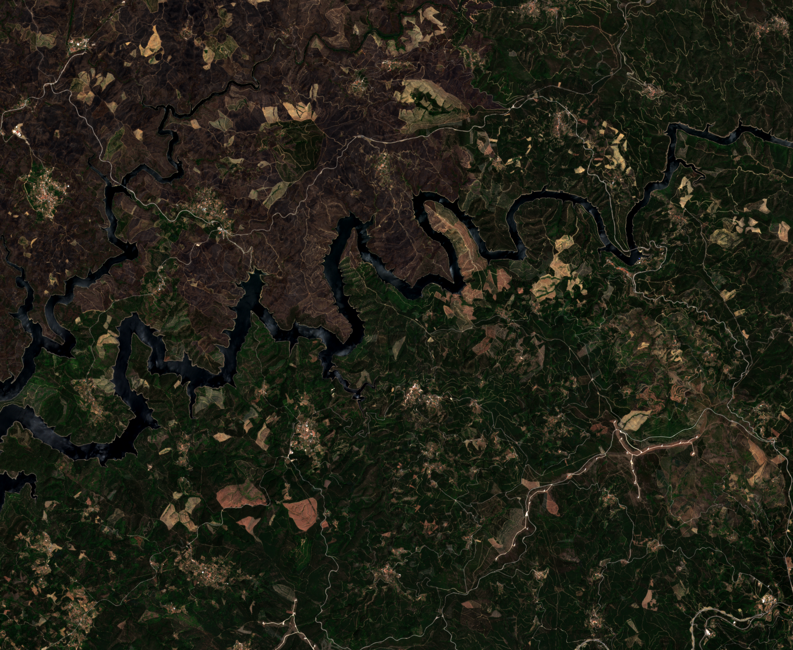
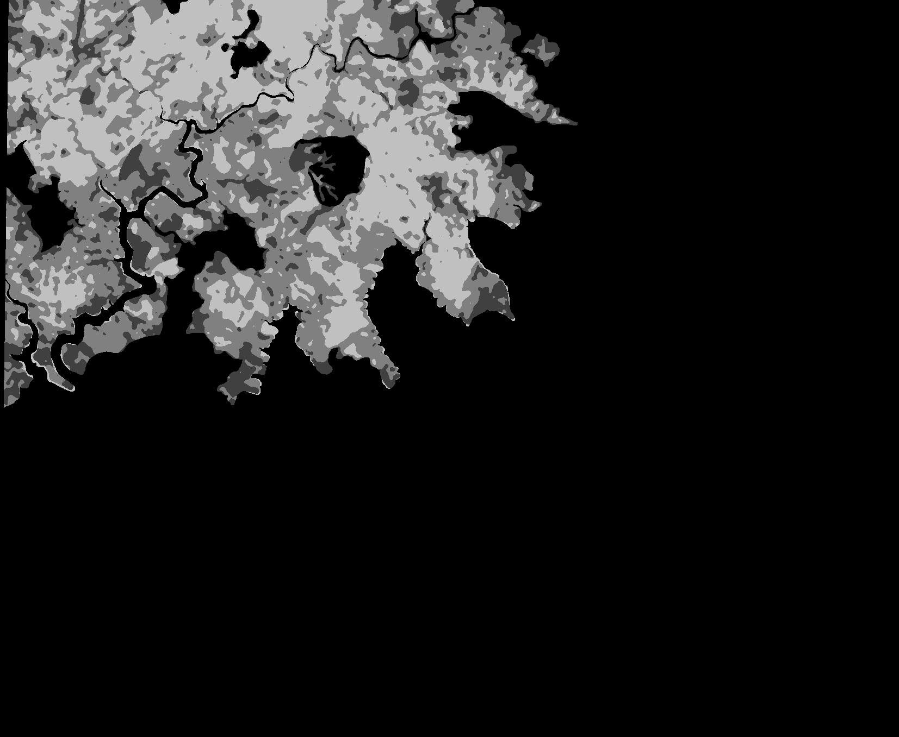

# Applied Data Science Project

 

    

    
     
    

  <h3 align="center">Weakly supervised burnt area discrimination pipeline   PoliTo 2022/2023</h3>

  

    In the following, the whole project is briefly presented in how it works and how the various scripts should be executed to reproduce our results.
  

<!-- TABLE OF CONTENTS -->

  
Table of Contents

  <ol>
    <li><a href="#about-the-project">About The Project</a></li>
  </ol>

<!-- ABOUT THE PROJECT -->
## About The Project
test

(<a href="#top">back to top</a>)

## Preprocessing
test

(<a href="#top">back to top</a>)

## Tests
test

(<a href="#top">back to top</a>)

## Presentation
test

(<a href="#top">back to top</a>)

## Interface
test

(<a href="#top">back to top</a>)

<!-- CONTACTS -->
## CONTACTS
Francesco Pagano  s299266@studenti.polito.it  
Sofia Fanigliulo  s300751@studenti.polito.it  
Giuseppe Esposito  s302179@studenti.polito.it  
Aurora Gensale  s303535@studenti.polito.it  
Elena Di Felice s303499 @studenti.polito.it  